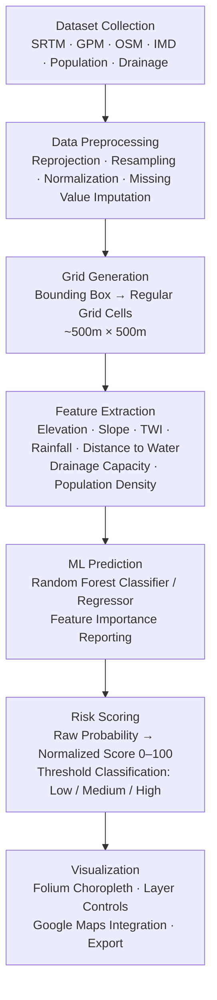

# Design Document

## Machine Learning-Based Flood Risk Zonation System Using Geospatial and Topographical Data

---

## Table of Contents

1. [Overview](#1-overview)
2. [Architecture](#2-architecture)
3. [Components and Interfaces](#3-components-and-interfaces)
4. [Data Models](#4-data-models)
5. [Correctness Properties](#5-correctness-properties)
6. [Error Handling](#6-error-handling)
7. [Testing Strategy](#7-testing-strategy)

---

## 1. Overview

### 1.1 Purpose

The Flood Risk Zonation System is an AI/ML-powered geospatial application that generates micro-level flood risk zone maps for arbitrary urban and semi-urban regions. It addresses the critical gap between macro-scale national flood forecasting systems (operating at 1–25 km resolution) and the granular, block-level risk intelligence required by urban planners, emergency managers, and infrastructure engineers.

The system ingests multi-source geospatial and environmental datasets — elevation (NASA SRTM), rainfall (IMD/NASA GPM), water bodies (OpenStreetMap), population density, and synthetic drainage capacity — and produces two primary outputs per spatial grid cell:

- **Flood Risk Score**: A continuous numerical value in the range [0, 100] representing the relative flood susceptibility of a grid cell.
- **Flood Risk Classification**: A categorical label — `Low`, `Medium`, or `High` — derived from the risk score using calibrated thresholds.

These outputs are rendered as interactive, multi-layer maps via a Streamlit web application, integrating Folium choropleth overlays and optional Google Maps base tiles.

### 1.2 Design Goals

- **Micro-level resolution**: Grid cells of approximately 500m × 500m (configurable), enabling block-level risk differentiation.
- **Automated pipeline**: End-to-end processing from raw dataset ingestion to interactive map generation without manual GIS intervention.
- **Interpretable ML**: Random Forest with feature importance reporting, so risk drivers (elevation, rainfall, drainage, etc.) are transparent to users.
- **Open-data first**: All primary datasets are freely available (NASA, IMD, OSM), ensuring accessibility for municipalities in developing countries.
- **Extensibility**: Modular pipeline design allows substitution of LightGBM for Random Forest, addition of new feature layers, or integration of real-time rainfall feeds.

### 1.3 Key Research Findings

The design is informed by established geospatial ML literature:

- **Feature set**: Studies on flood susceptibility mapping consistently identify elevation, slope, Topographic Wetness Index (TWI), distance to water bodies, rainfall intensity, and drainage density as the most predictive conditioning factors ([MDPI Water, 2021](https://www.mdpi.com/2073-4441/13/21/3115); [Nature Scientific Reports, 2026](https://www.nature.com/articles/s41598-026-47925-5)).
- **TWI formula**: `TWI = ln(A / tan(β))` where `A` is the upslope contributing area per unit contour length (m²/m) and `β` is the local slope in radians. TWI is a well-validated proxy for soil moisture accumulation and surface saturation ([USGS](https://data.usgs.gov/datacatalog/data/USGS:56f97be4e4b0a6037df06b70)).
- **Random Forest performance**: RF consistently achieves AUC > 0.90 in flood susceptibility studies and provides native feature importance scores, making it the primary model choice ([arxiv:2512.13710](https://arxiv.org/abs/2512.13710)).
- **NASA SRTM**: 1 arc-second (~30m) resolution DEM covering 56°S–60°N, the standard elevation source for flood studies globally ([NASA Earthdata](https://www.earthdata.nasa.gov/sensors/srtm)).
- **NASA GPM IMERG**: Half-hourly, 0.1° resolution global precipitation product, suitable for deriving mean annual and seasonal rainfall statistics per grid cell ([NASA GPM](https://gpm.nasa.gov/resources/documents/imerg-v07-atbd)).

---

## 2. Architecture

### 2.1 High-Level Architecture

The system follows a layered pipeline architecture with five distinct tiers:

```
┌─────────────────────────────────────────────────────────────────┐
│                     PRESENTATION TIER                           │
│              Streamlit Web Application (app.py)                 │
│         Folium Interactive Maps + Google Maps Tiles             │
└──────────────────────────┬──────────────────────────────────────┘
                           │
┌──────────────────────────▼──────────────────────────────────────┐
│                    ORCHESTRATION TIER                           │
│              Pipeline Controller (pipeline.py)                  │
│         Coordinates stage execution and data flow               │
└──────────────────────────┬──────────────────────────────────────┘
                           │
┌──────────────────────────▼──────────────────────────────────────┐
│                    PROCESSING TIER                              │
│  ┌─────────────┐  ┌──────────────┐  ┌────────────────────────┐ │
│  │ Data Ingest │  │ Grid Engine  │  │  Feature Extractor     │ │
│  │ & Preprocess│  │ (grid.py)    │  │  (features.py)         │ │
│  │ (ingest.py) │  │              │  │                        │ │
│  └─────────────┘  └──────────────┘  └────────────────────────┘ │
└──────────────────────────┬──────────────────────────────────────┘
                           │
┌──────────────────────────▼──────────────────────────────────────┐
│                    ML INFERENCE TIER                            │
│  ┌──────────────────────┐  ┌──────────────────────────────────┐ │
│  │  Model Trainer       │  │  Risk Scorer                     │ │
│  │  (model.py)          │  │  (scorer.py)                     │ │
│  │  Random Forest /     │  │  Score normalization +           │ │
│  │  LightGBM            │  │  Classification thresholds       │ │
│  └──────────────────────┘  └──────────────────────────────────┘ │
└──────────────────────────┬──────────────────────────────────────┘
                           │
┌──────────────────────────▼──────────────────────────────────────┐
│                      DATA TIER                                  │
│  Raw Datasets (SRTM, GPM, OSM, IMD, Population, Drainage)      │
│  Processed GeoDataFrames (GeoParquet / GeoJSON cache)           │
│  Trained Model Artifacts (joblib serialized)                    │
└─────────────────────────────────────────────────────────────────┘
```

### 2.2 Processing Pipeline

The end-to-end workflow follows a directed acyclic graph (DAG) of stages:



### 2.3 Technology Stack

| Layer | Technology | Version / Notes |
|---|---|---|
| Frontend / UI | Streamlit | ≥ 1.35 |
| Map Rendering | Folium | ≥ 0.17 |
| Base Tiles | Google Maps API / OpenStreetMap | Optional API key |
| ML Framework | Scikit-learn (Random Forest) | ≥ 1.4 |
| Optional ML | LightGBM | ≥ 4.3 |
| Geospatial | GeoPandas | ≥ 0.14 |
| Raster Processing | Rasterio | ≥ 1.3 |
| Data Processing | Pandas, NumPy | ≥ 2.0, ≥ 1.26 |
| Coordinate Systems | PyProj | ≥ 3.6 |
| Serialization | Joblib | ≥ 1.3 |
| Visualization | Matplotlib, Seaborn | ≥ 3.8, ≥ 0.13 |

---

## 3. Components and Interfaces

### 3.1 Component Overview

```
flood_risk_zonation/
├── app.py                        # Streamlit entry point
├── pipeline.py                   # Pipeline orchestrator
├── config.py                     # Configuration constants
├── ingest/
│   ├── __init__.py
│   ├── elevation.py              # SRTM DEM loader and resampler
│   ├── rainfall.py               # IMD / NASA GPM loader
│   ├── water_bodies.py           # OSM water body extractor
│   ├── population.py             # Population density loader
│   └── drainage.py               # Synthetic drainage capacity generator
├── grid/
│   ├── __init__.py
│   └── generator.py              # Bounding box → grid cell GeoDataFrame
├── features/
│   ├── __init__.py
│   ├── terrain.py                # Elevation, slope, TWI computation
│   ├── hydrological.py           # Distance to water, drainage density
│   ├── rainfall_features.py      # Mean annual / seasonal rainfall per cell
│   └── extractor.py              # Feature assembly and normalization
├── model/
│   ├── __init__.py
│   ├── trainer.py                # Model training and cross-validation
│   ├── predictor.py              # Inference on new grid data
│   └── artifacts/                # Serialized model files (.joblib)
├── scoring/
│   ├── __init__.py
│   └── scorer.py                 # Score normalization and classification
├── visualization/
│   ├── __init__.py
│   ├── map_builder.py            # Folium map construction
│   ├── layers.py                 # Individual layer builders
│   └── export.py                 # HTML / GeoJSON / CSV export
├── utils/
│   ├── __init__.py
│   ├── crs.py                    # CRS utilities and reprojection helpers
│   ├── validation.py             # Input validation functions
│   └── cache.py                  # GeoParquet caching utilities
└── tests/
    ├── unit/
    ├── integration/
    └── property/
```

### 3.2 Pipeline Orchestrator (`pipeline.py`)

The `FloodRiskPipeline` class is the central coordinator. It accepts a `PipelineConfig` and executes stages in order, passing `GeoDataFrame` objects between stages.

```python
class FloodRiskPipeline:
    def __init__(self, config: PipelineConfig) -> None: ...

    def run(self, bounding_box: BoundingBox) -> FloodRiskResult:
        """
        Execute the full pipeline for a given bounding box.
        Returns a FloodRiskResult containing the scored GeoDataFrame
        and a trained model artifact.
        """
        ...

    def run_stage(self, stage_name: str, *args, **kwargs) -> Any:
        """Execute a single named pipeline stage (for incremental runs)."""
        ...
```

### 3.3 Grid Generator (`grid/generator.py`)

Generates a regular grid of rectangular cells covering the bounding box. Each cell is represented as a Shapely `Polygon` in the target CRS.

```python
def generate_grid(
    bounding_box: BoundingBox,
    cell_size_meters: float = 500.0,
    crs: str = "EPSG:4326",
) -> gpd.GeoDataFrame:
    """
    Partition the bounding box into a regular grid of square cells.

    Parameters
    ----------
    bounding_box : BoundingBox
        Geographic extent (min_lon, min_lat, max_lon, max_lat).
    cell_size_meters : float
        Approximate cell edge length in meters. Converted to degrees
        using the local latitude for the WGS84 projection.
    crs : str
        Output coordinate reference system (default WGS84).

    Returns
    -------
    gpd.GeoDataFrame
        One row per grid cell with columns: cell_id, geometry, centroid_lat, centroid_lon.
    """
    ...
```

### 3.4 Feature Extractor (`features/extractor.py`)

Assembles all feature layers into a single feature matrix aligned to the grid.

```python
FEATURE_COLUMNS = [
    "elevation_m",           # Mean elevation within cell (metres, SRTM)
    "slope_deg",             # Mean slope within cell (degrees)
    "twi",                   # Topographic Wetness Index: ln(A / tan(β))
    "rainfall_mean_mm",      # Mean annual rainfall (mm, GPM/IMD)
    "rainfall_max_24h_mm",   # Maximum 24-hour rainfall (mm)
    "dist_water_m",          # Distance to nearest water body (metres, OSM)
    "drainage_capacity",     # Synthetic drainage capacity score [0, 1]
    "population_density",    # Persons per km² (log-scaled)
    "aspect_deg",            # Terrain aspect (degrees from north)
    "curvature",             # Plan curvature (concavity/convexity)
]

def extract_features(
    grid: gpd.GeoDataFrame,
    elevation_raster: RasterDataset,
    rainfall_data: RainfallDataset,
    water_bodies: gpd.GeoDataFrame,
    population_raster: RasterDataset,
    drainage_data: DrainageDataset,
) -> gpd.GeoDataFrame:
    """
    Compute all features for each grid cell.
    Returns the input GeoDataFrame with FEATURE_COLUMNS appended.
    """
    ...
```

### 3.5 Terrain Feature Computation (`features/terrain.py`)

```python
def compute_slope(dem_array: np.ndarray, cell_size_m: float) -> np.ndarray:
    """
    Compute slope in degrees from a DEM array using the Horn (1981) method.
    Uses numpy gradient for dz/dx and dz/dy, then arctan of the magnitude.
    """
    ...

def compute_twi(dem_array: np.ndarray, cell_size_m: float) -> np.ndarray:
    """
    Compute Topographic Wetness Index: TWI = ln(A / tan(β))
    where A is the upslope contributing area (m²/m) approximated via
    D8 flow accumulation, and β is the slope in radians.
    A small epsilon (1e-6) is added to tan(β) to prevent division by zero
    on flat terrain.
    """
    ...

def compute_aspect(dem_array: np.ndarray) -> np.ndarray:
    """Compute terrain aspect in degrees (0–360, clockwise from north)."""
    ...
```

### 3.6 Model Trainer (`model/trainer.py`)

```python
class FloodRiskModelTrainer:
    def __init__(self, model_type: Literal["random_forest", "lightgbm"] = "random_forest") -> None: ...

    def train(
        self,
        X: pd.DataFrame,
        y: pd.Series,
        cv_folds: int = 5,
    ) -> TrainingResult:
        """
        Train the flood risk model with stratified k-fold cross-validation.
        Returns a TrainingResult containing the fitted model, CV scores,
        and feature importance rankings.
        """
        ...

    def save(self, path: Path) -> None:
        """Serialize the trained model to a .joblib file."""
        ...

    @classmethod
    def load(cls, path: Path) -> "FloodRiskModelTrainer":
        """Deserialize a previously trained model."""
        ...
```

### 3.7 Risk Scorer (`scoring/scorer.py`)

```python
class FloodRiskScorer:
    # Default classification thresholds (configurable)
    DEFAULT_THRESHOLDS = {"low_max": 33.0, "medium_max": 66.0}

    def normalize_scores(self, raw_probabilities: np.ndarray) -> np.ndarray:
        """
        Map raw model output probabilities [0, 1] to a normalized
        Flood Risk Score in [0, 100] using min-max scaling calibrated
        against the training distribution.
        """
        ...

    def classify(
        self,
        scores: np.ndarray,
        thresholds: dict[str, float] | None = None,
    ) -> np.ndarray:
        """
        Apply threshold classification to produce categorical labels.
        score ∈ [0, low_max]       → "Low"
        score ∈ (low_max, medium_max] → "Medium"
        score ∈ (medium_max, 100]  → "High"
        """
        ...

    def score_grid(
        self,
        grid: gpd.GeoDataFrame,
        model: Any,
        feature_columns: list[str],
    ) -> gpd.GeoDataFrame:
        """
        Run end-to-end scoring: predict → normalize → classify.
        Appends 'risk_score' and 'risk_class' columns to the grid.
        """
        ...
```

### 3.8 Map Builder (`visualization/map_builder.py`)

```python
class FloodRiskMapBuilder:
    RISK_COLOR_MAP = {
        "Low": "#2ecc71",      # Green
        "Medium": "#f39c12",   # Amber
        "High": "#e74c3c",     # Red
    }

    def build_choropleth_map(
        self,
        scored_grid: gpd.GeoDataFrame,
        center: tuple[float, float],
        zoom_start: int = 12,
        use_google_maps: bool = False,
        google_maps_api_key: str | None = None,
    ) -> folium.Map:
        """
        Construct a Folium map with:
        - Risk classification choropleth layer (color-coded polygons)
        - Risk score continuous heatmap layer
        - Population density overlay
        - Water bodies overlay
        - Layer control toggle
        - Cell click popups with full feature breakdown
        """
        ...

    def add_popup_layer(self, folium_map: folium.Map, grid: gpd.GeoDataFrame) -> folium.Map:
        """
        Add click-to-inspect popups showing: risk score, risk class,
        elevation, slope, TWI, rainfall, distance to water, drainage capacity.
        """
        ...
```

### 3.9 Streamlit Application (`app.py`)

The Streamlit app provides the user-facing interface with the following page structure:

```
┌─────────────────────────────────────────────────────────────────┐
│  SIDEBAR                                                        │
│  ├── Region Selection (bounding box or city name lookup)        │
│  ├── Grid Resolution (250m / 500m / 1000m)                      │
│  ├── Rainfall Scenario (Historical / Custom mm)                 │
│  ├── Model Selection (Random Forest / LightGBM)                 │
│  ├── Classification Thresholds (Low/Medium/High sliders)        │
│  └── Run Analysis Button                                        │
├─────────────────────────────────────────────────────────────────┤
│  MAIN PANEL                                                     │
│  ├── Tab 1: Interactive Map (Folium choropleth)                 │
│  ├── Tab 2: Risk Statistics (bar charts, pie chart)             │
│  ├── Tab 3: Feature Importance (horizontal bar chart)           │
│  ├── Tab 4: Data Table (filterable grid with export)            │
│  └── Tab 5: Methodology (documentation)                        │
└─────────────────────────────────────────────────────────────────┘
```

---

## 4. Data Models

### 4.1 Core Data Structures

#### `BoundingBox`

```python
@dataclass(frozen=True)
class BoundingBox:
    min_lon: float   # Western boundary (decimal degrees, WGS84)
    min_lat: float   # Southern boundary
    max_lon: float   # Eastern boundary
    max_lat: float   # Northern boundary

    def __post_init__(self) -> None:
        assert -180 <= self.min_lon < self.max_lon <= 180
        assert -90  <= self.min_lat < self.max_lat <= 90

    @property
    def center(self) -> tuple[float, float]:
        return ((self.min_lat + self.max_lat) / 2,
                (self.min_lon + self.max_lon) / 2)

    @property
    def area_km2(self) -> float:
        """Approximate area using equirectangular projection."""
        ...
```

#### `GridCell`

Each row in the processed `GeoDataFrame` corresponds to one `GridCell`. The schema is:

| Column | Type | Description |
|---|---|---|
| `cell_id` | `str` | Unique identifier: `"{row_idx}_{col_idx}"` |
| `geometry` | `Polygon` | Shapely polygon in WGS84 |
| `centroid_lat` | `float` | Cell centroid latitude |
| `centroid_lon` | `float` | Cell centroid longitude |
| `elevation_m` | `float` | Mean elevation (metres, SRTM) |
| `slope_deg` | `float` | Mean slope (degrees) |
| `twi` | `float` | Topographic Wetness Index |
| `aspect_deg` | `float` | Terrain aspect (degrees) |
| `curvature` | `float` | Plan curvature |
| `rainfall_mean_mm` | `float` | Mean annual rainfall (mm) |
| `rainfall_max_24h_mm` | `float` | Max 24-hour rainfall (mm) |
| `dist_water_m` | `float` | Distance to nearest water body (m) |
| `drainage_capacity` | `float` | Synthetic drainage score [0, 1] |
| `population_density` | `float` | Log-scaled persons/km² |
| `risk_score` | `float` | Flood Risk Score [0, 100] |
| `risk_class` | `str` | `"Low"` / `"Medium"` / `"High"` |

#### `PipelineConfig`

```python
@dataclass
class PipelineConfig:
    cell_size_meters: float = 500.0
    model_type: Literal["random_forest", "lightgbm"] = "random_forest"
    rf_n_estimators: int = 200
    rf_max_depth: int | None = None
    rf_min_samples_leaf: int = 5
    cv_folds: int = 5
    low_threshold: float = 33.0      # Risk score upper bound for "Low"
    medium_threshold: float = 66.0   # Risk score upper bound for "Medium"
    use_cache: bool = True
    cache_dir: Path = Path("data/cache")
    model_artifact_dir: Path = Path("model/artifacts")
    google_maps_api_key: str | None = None
    random_seed: int = 42
```

#### `TrainingResult`

```python
@dataclass
class TrainingResult:
    model: Any                              # Fitted sklearn / lgbm estimator
    feature_names: list[str]
    feature_importances: dict[str, float]   # Feature name → importance score
    cv_scores: dict[str, list[float]]       # Metric name → per-fold scores
    mean_cv_auc: float
    mean_cv_f1: float
    training_timestamp: datetime
```

#### `FloodRiskResult`

```python
@dataclass
class FloodRiskResult:
    scored_grid: gpd.GeoDataFrame           # Full grid with risk_score + risk_class
    training_result: TrainingResult
    bounding_box: BoundingBox
    config: PipelineConfig
    pipeline_duration_seconds: float
    cell_count: int

    @property
    def risk_distribution(self) -> dict[str, int]:
        """Returns count of cells per risk class."""
        return self.scored_grid["risk_class"].value_counts().to_dict()

    @property
    def high_risk_cells(self) -> gpd.GeoDataFrame:
        return self.scored_grid[self.scored_grid["risk_class"] == "High"]
```

### 4.2 Dataset Schemas

#### Elevation Dataset (`RasterDataset`)

```python
@dataclass
class RasterDataset:
    array: np.ndarray          # 2D float32 array of values
    transform: Affine          # Rasterio affine transform
    crs: CRS                   # Coordinate reference system
    nodata: float | None       # NoData sentinel value
    source: str                # Dataset provenance string
```

#### Rainfall Dataset (`RainfallDataset`)

```python
@dataclass
class RainfallDataset:
    mean_annual_mm: np.ndarray      # Gridded mean annual rainfall
    max_24h_mm: np.ndarray          # Gridded max 24-hour rainfall
    transform: Affine
    crs: CRS
    temporal_range: tuple[date, date]
    source: Literal["IMD", "NASA_GPM", "synthetic"]
```

### 4.3 Synthetic Data Generation

When real datasets are unavailable (development, testing, demo mode), the system generates synthetic datasets that preserve realistic statistical properties:

```python
def generate_synthetic_elevation(
    bounding_box: BoundingBox,
    resolution_m: float = 30.0,
    base_elevation_m: float = 50.0,
    relief_m: float = 100.0,
    seed: int = 42,
) -> RasterDataset:
    """
    Generate a synthetic DEM using Perlin noise to simulate realistic
    terrain with valleys, ridges, and flat plains.
    """
    ...

def generate_synthetic_drainage(
    grid: gpd.GeoDataFrame,
    seed: int = 42,
) -> gpd.GeoDataFrame:
    """
    Assign synthetic drainage capacity scores [0, 1] to grid cells,
    inversely correlated with population density to simulate urban
    impervious surface effects.
    """
    ...
```

### 4.4 Feature Engineering Details

#### Topographic Wetness Index (TWI)

TWI quantifies the tendency of a location to accumulate water based on terrain shape. The formula is:

```
TWI = ln(A / tan(β))
```

Where:
- `A` = upslope contributing area per unit contour length (m²/m), approximated via D8 flow accumulation on the DEM
- `β` = local slope angle in radians
- A small epsilon `ε = 1e-6` is added to `tan(β)` to handle flat terrain (β ≈ 0)

Higher TWI values indicate topographic depressions and convergence zones where water accumulates — primary flood risk indicators.

#### Distance to Water Bodies

Computed as the minimum Euclidean distance from each grid cell centroid to the nearest OSM water body polygon boundary, using GeoPandas spatial indexing (`STRtree`) for efficiency. Distances are capped at 10,000m and log-transformed before use as a feature.

#### Drainage Capacity Score

A synthetic score in [0, 1] representing the estimated drainage infrastructure capacity of each cell:
- Derived from population density (proxy for urban impervious surface coverage)
- Optionally augmented with OpenStreetMap road network density as a drainage proxy
- Score of 1.0 = excellent drainage; 0.0 = no drainage capacity

#### Rainfall Features

Two rainfall features are extracted per grid cell:
1. **Mean annual rainfall (mm)**: Long-term average from GPM IMERG Final Run (2001–present) or IMD gridded data
2. **Maximum 24-hour rainfall (mm)**: 95th percentile of daily rainfall totals, representing extreme event intensity

### 4.5 Risk Score Normalization

Raw model output is the predicted probability of the "High" flood risk class from the Random Forest classifier. This probability is normalized to a [0, 100] score using min-max scaling calibrated against the training distribution:

```
risk_score = (p_high - p_min) / (p_max - p_min) × 100
```

Where `p_min` and `p_max` are the 1st and 99th percentile of predicted probabilities across all training cells, stored as part of the model artifact to ensure consistent scoring on new data.

Classification thresholds (default: Low ≤ 33, Medium ≤ 66, High > 66) are configurable via `PipelineConfig` and the Streamlit sidebar.

---

## 5. Correctness Properties

*A property is a characteristic or behavior that should hold true across all valid executions of a system — essentially, a formal statement about what the system should do. Properties serve as the bridge between human-readable specifications and machine-verifiable correctness guarantees.*

The flood risk zonation system contains substantial pure-function logic (coordinate transformations, feature engineering formulas, score normalization, classification thresholds, grid geometry generation) that is well-suited to property-based testing. The following properties are derived from the acceptance criteria and cover the core correctness invariants of the system.

---

### Property 1: Raster Reprojection Preserves Target CRS

*For any* valid raster dataset in any source coordinate reference system, after reprojection to WGS84 (EPSG:4326), the output raster SHALL have CRS equal to EPSG:4326 and the output cell values SHALL be finite (no NaN introduced by reprojection alone).

**Validates: Requirements 1.1**

---

### Property 2: Missing Value Imputation Completeness

*For any* rainfall or elevation array containing an arbitrary pattern of NaN values (including fully populated and partially populated arrays), after spatial imputation the output array SHALL contain no NaN values.

**Validates: Requirements 1.2**

---

### Property 3: Grid Coverage Completeness

*For any* valid `BoundingBox`, the union of all grid cell geometries produced by `generate_grid` SHALL contain the bounding box polygon. No point within the bounding box shall fall outside all grid cells.

**Validates: Requirements 2.1**

---

### Property 4: Grid Cell Size Accuracy

*For any* valid `BoundingBox` and positive `cell_size_meters`, every grid cell produced by `generate_grid` SHALL have an area within ±10% of `cell_size_meters²` (accounting for latitude-dependent degree-to-metre conversion).

**Validates: Requirements 2.2**

---

### Property 5: Grid Cell Uniqueness and Non-Overlap

*For any* valid `BoundingBox` and `cell_size_meters`, the generated grid SHALL satisfy two invariants simultaneously: (a) all `cell_id` values are unique across the grid, and (b) no two distinct cells have overlapping interiors (pairwise intersection area is zero within floating-point tolerance).

**Validates: Requirements 2.3, 2.4**

---

### Property 6: Feature Extraction Produces Valid, Complete Feature Matrices

*For any* valid combination of DEM, rainfall, water body, population, and drainage datasets covering a bounding box, the assembled feature matrix SHALL contain no NaN values, no infinite values, and all features SHALL fall within physically valid ranges: elevation ∈ (−500, 9000) m, slope ∈ [0, 90]°, TWI ∈ (−∞, +∞) but finite, distance to water ≥ 0, drainage capacity ∈ [0, 1], population density ≥ 0.

**Validates: Requirements 3.1, 3.4**

---

### Property 7: TWI Formula Correctness

*For any* DEM array with known slope values β and upslope contributing area A, the computed TWI SHALL equal `ln(A / (tan(β) + ε))` where `ε = 1e-6`, matching the reference formula within floating-point precision. Flat terrain (β = 0) SHALL produce a finite TWI value (not infinity or NaN).

**Validates: Requirements 3.2**

---

### Property 8: Distance to Water Non-Negativity

*For any* set of grid cell centroids and any set of water body geometries (including the edge case of no water bodies present), the computed distance from each centroid to the nearest water body SHALL be non-negative.

**Validates: Requirements 3.3**

---

### Property 9: Model Serialization Round-Trip

*For any* trained flood risk model and any valid feature matrix X, serializing the model to disk with `joblib.dump` and deserializing with `joblib.load` SHALL produce a model that generates predictions identical (bit-for-bit equal) to the original model's predictions on X.

**Validates: Requirements 4.2**

---

### Property 10: Predicted Probabilities Are Valid

*For any* valid feature matrix X (no NaN, no inf, all features in valid ranges), the flood risk model's `predict_proba` output SHALL satisfy: all values ∈ [0, 1], and for each sample the probabilities across all classes sum to 1.0 within floating-point tolerance (|sum − 1| < 1e-9).

**Validates: Requirements 4.4**

---

### Property 11: Risk Score Normalization Bounds

*For any* array of raw model probabilities in [0, 1], the `normalize_scores` function SHALL produce an output array where every element is in [0, 100] (inclusive). The minimum output value SHALL be 0 and the maximum SHALL be 100 when the input contains both the calibration minimum and maximum.

**Validates: Requirements 5.1**

---

### Property 12: Risk Classification Threshold Correctness

*For any* risk score `s ∈ [0, 100]` and any valid threshold pair `(low_max, medium_max)` where `0 < low_max < medium_max < 100`, the `classify` function SHALL produce exactly one label from `{"Low", "Medium", "High"}` according to the rule: `s ≤ low_max → "Low"`, `low_max < s ≤ medium_max → "Medium"`, `s > medium_max → "High"`. No score shall be unclassified or receive multiple labels.

**Validates: Requirements 5.2, 5.3**

---

### Property 13: Visualization Color Mapping Correctness

*For any* scored `GeoDataFrame` where each cell has a `risk_class` in `{"Low", "Medium", "High"}`, the choropleth map built by `FloodRiskMapBuilder` SHALL assign each cell a fill color that exactly matches `RISK_COLOR_MAP[risk_class]`. No cell shall receive a color inconsistent with its risk classification.

**Validates: Requirements 6.1**

---

### Property 14: Popup Content Completeness

*For any* grid cell with all feature columns populated, the popup HTML generated by `add_popup_layer` SHALL contain all of the following fields: risk score, risk class, elevation, slope, TWI, mean annual rainfall, distance to water, and drainage capacity. The popup SHALL not be empty for any cell.

**Validates: Requirements 6.2**

---

### Property 15: Pipeline Output Completeness

*For any* valid `BoundingBox` and `PipelineConfig` (using synthetic data), the `FloodRiskPipeline.run` method SHALL return a `FloodRiskResult` where every grid cell in `scored_grid` has a non-null `risk_score` in [0, 100] and a non-null `risk_class` in `{"Low", "Medium", "High"}`. No cell shall be missing either output column.

**Validates: Requirements 7.1**

---

### Property 16: Pipeline Determinism

*For any* valid `BoundingBox` and `PipelineConfig` with a fixed `random_seed`, running `FloodRiskPipeline.run` twice with identical inputs SHALL produce `scored_grid` DataFrames that are identical row-by-row (same `risk_score` and `risk_class` for every cell).

**Validates: Requirements 7.2**

---

### Property 17: Invalid Input Rejection

*For any* invalid configuration input — including bounding boxes where `min_lon ≥ max_lon`, `min_lat ≥ max_lat`, coordinates outside WGS84 bounds, non-positive `cell_size_meters`, or threshold pairs where `low_threshold ≥ medium_threshold` — the system SHALL raise a `ValueError` with a descriptive message identifying the invalid parameter. No invalid configuration shall silently produce incorrect output.

**Validates: Requirements 7.3, 8.1, 8.2**

---

## 6. Error Handling

### 6.1 Error Categories

The system defines a hierarchy of domain-specific exceptions:

```python
class FloodRiskError(Exception):
    """Base exception for all flood risk system errors."""

class DataIngestionError(FloodRiskError):
    """Raised when a dataset cannot be loaded or parsed."""

class DataAlignmentError(FloodRiskError):
    """Raised when datasets cannot be spatially aligned."""

class FeatureExtractionError(FloodRiskError):
    """Raised when feature computation fails for a grid cell."""

class ModelTrainingError(FloodRiskError):
    """Raised when model training fails (e.g., insufficient data)."""

class ScoringError(FloodRiskError):
    """Raised when risk scoring produces invalid outputs."""

class ConfigurationError(ValueError, FloodRiskError):
    """Raised for invalid pipeline configuration parameters."""
```

### 6.2 Error Handling Strategy by Component

| Component | Error Condition | Handling Strategy |
|---|---|---|
| `BoundingBox` | `min_lon >= max_lon` or coordinates out of WGS84 range | Raise `ConfigurationError` in `__post_init__` |
| `PipelineConfig` | `low_threshold >= medium_threshold` | Raise `ConfigurationError` |
| `PipelineConfig` | `cell_size_meters <= 0` | Raise `ConfigurationError` |
| `elevation.py` | SRTM file not found or corrupt | Raise `DataIngestionError` with file path |
| `elevation.py` | Bounding box outside SRTM coverage | Raise `DataIngestionError` with coverage info |
| `rainfall.py` | GPM/IMD file missing | Fall back to synthetic rainfall with warning log |
| `terrain.py` | DEM contains all-NaN region | Raise `FeatureExtractionError` with cell coordinates |
| `terrain.py` | Slope computation produces NaN | Replace with 0.0 (flat terrain assumption) and log warning |
| `trainer.py` | Training data has fewer than 50 samples | Raise `ModelTrainingError` |
| `trainer.py` | All samples belong to one class | Raise `ModelTrainingError` with class distribution info |
| `scorer.py` | Normalization produces values outside [0, 100] | Clip to [0, 100] and log warning |
| `map_builder.py` | Google Maps API key invalid | Fall back to OpenStreetMap tiles with warning |
| `app.py` | Pipeline raises any `FloodRiskError` | Display user-friendly error message in Streamlit UI |

### 6.3 Graceful Degradation

The system implements a tiered fallback strategy for dataset availability:

```
Tier 1 (Preferred): Real datasets (SRTM + GPM + OSM + IMD + Population)
Tier 2 (Partial):   Real elevation + synthetic rainfall/drainage
Tier 3 (Demo):      Fully synthetic datasets (Perlin noise DEM + synthetic rainfall)
```

The active tier is logged and displayed in the Streamlit UI so users understand data provenance.

### 6.4 Input Validation

All public API entry points validate inputs before processing:

```python
def validate_bounding_box(bbox: BoundingBox) -> None:
    """Validate geographic bounds and minimum area."""
    if bbox.min_lon >= bbox.max_lon:
        raise ConfigurationError(
            f"min_lon ({bbox.min_lon}) must be less than max_lon ({bbox.max_lon})"
        )
    if bbox.min_lat >= bbox.max_lat:
        raise ConfigurationError(
            f"min_lat ({bbox.min_lat}) must be less than max_lat ({bbox.max_lat})"
        )
    if bbox.area_km2 < 1.0:
        raise ConfigurationError(
            f"Bounding box area ({bbox.area_km2:.2f} km²) is too small. Minimum: 1 km²"
        )
    if bbox.area_km2 > 50_000.0:
        raise ConfigurationError(
            f"Bounding box area ({bbox.area_km2:.2f} km²) exceeds maximum (50,000 km²)"
        )

def validate_config(config: PipelineConfig) -> None:
    """Validate pipeline configuration parameters."""
    if config.cell_size_meters <= 0:
        raise ConfigurationError(f"cell_size_meters must be positive, got {config.cell_size_meters}")
    if config.low_threshold >= config.medium_threshold:
        raise ConfigurationError(
            f"low_threshold ({config.low_threshold}) must be less than "
            f"medium_threshold ({config.medium_threshold})"
        )
    if not (0 < config.low_threshold < 100):
        raise ConfigurationError(f"low_threshold must be in (0, 100), got {config.low_threshold}")
    if not (0 < config.medium_threshold < 100):
        raise ConfigurationError(f"medium_threshold must be in (0, 100), got {config.medium_threshold}")
```

---

## 7. Testing Strategy

### 7.1 Overview

The testing strategy employs a dual approach combining property-based tests (for universal correctness guarantees) and example-based unit/integration tests (for specific scenarios and edge cases). This combination ensures both broad input coverage and targeted verification of critical behaviors.

### 7.2 Property-Based Testing

**Library**: [Hypothesis](https://hypothesis.readthedocs.io/) (Python)

**Configuration**: Each property test runs a minimum of **100 iterations** (configurable via `settings(max_examples=100)`). Hypothesis automatically shrinks failing examples to minimal reproducible cases.

**Tag format**: Each property test is annotated with:
```python
# Feature: flood-risk-zonation-system, Property {N}: {property_text}
```

**Property test implementations** (one test per property):

```python
from hypothesis import given, settings, assume
from hypothesis import strategies as st
import numpy as np

# Feature: flood-risk-zonation-system, Property 1: Raster reprojection preserves target CRS
@given(st.floats(min_value=-89, max_value=89))  # source latitude for UTM zone selection
@settings(max_examples=100)
def test_reprojection_preserves_wgs84_crs(source_lat):
    ...

# Feature: flood-risk-zonation-system, Property 2: Missing value imputation completeness
@given(st.lists(st.floats(allow_nan=True), min_size=4, max_size=100))
@settings(max_examples=100)
def test_imputation_removes_all_nans(values_with_nans):
    ...

# Feature: flood-risk-zonation-system, Property 3: Grid coverage completeness
@given(
    min_lon=st.floats(-179, 178), min_lat=st.floats(-89, 88),
    delta_lon=st.floats(0.01, 2.0), delta_lat=st.floats(0.01, 2.0)
)
@settings(max_examples=100)
def test_grid_covers_bounding_box(min_lon, min_lat, delta_lon, delta_lat):
    ...

# Feature: flood-risk-zonation-system, Property 12: Risk classification threshold correctness
@given(
    score=st.floats(min_value=0.0, max_value=100.0),
    low_max=st.floats(min_value=1.0, max_value=49.0),
    medium_max=st.floats(min_value=51.0, max_value=99.0),
)
@settings(max_examples=100)
def test_classification_threshold_correctness(score, low_max, medium_max):
    assume(low_max < medium_max)
    result = FloodRiskScorer().classify(np.array([score]), {"low_max": low_max, "medium_max": medium_max})[0]
    if score <= low_max:
        assert result == "Low"
    elif score <= medium_max:
        assert result == "Medium"
    else:
        assert result == "High"
```

### 7.3 Unit Tests

Unit tests cover specific examples, edge cases, and integration points between components. They are organized to mirror the source module structure:

```
tests/
├── unit/
│   ├── test_bounding_box.py          # BoundingBox validation, area calculation
│   ├── test_grid_generator.py        # Grid generation edge cases
│   ├── test_terrain_features.py      # Slope, TWI, aspect computation
│   ├── test_hydrological_features.py # Distance to water, drainage
│   ├── test_scorer.py                # Score normalization, classification
│   ├── test_map_builder.py           # Map construction, popup content
│   └── test_validation.py            # Input validation functions
├── integration/
│   ├── test_pipeline_synthetic.py    # Full pipeline with synthetic data
│   ├── test_model_training.py        # Model training and CV scoring
│   └── test_export.py                # HTML/GeoJSON/CSV export
└── property/
    ├── test_grid_properties.py       # Properties 3, 4, 5
    ├── test_feature_properties.py    # Properties 6, 7, 8
    ├── test_model_properties.py      # Properties 9, 10
    ├── test_scoring_properties.py    # Properties 11, 12
    ├── test_visualization_properties.py  # Properties 13, 14
    ├── test_pipeline_properties.py   # Properties 15, 16
    └── test_validation_properties.py # Properties 1, 2, 17
```

**Key unit test examples**:

```python
# Edge case: flat terrain (slope = 0) should not produce infinite TWI
def test_twi_flat_terrain_is_finite():
    flat_dem = np.zeros((10, 10), dtype=np.float32)
    twi = compute_twi(flat_dem, cell_size_m=500.0)
    assert np.all(np.isfinite(twi))

# Edge case: bounding box with zero area should raise ConfigurationError
def test_zero_area_bounding_box_raises():
    with pytest.raises(ConfigurationError, match="min_lon"):
        BoundingBox(min_lon=10.0, min_lat=20.0, max_lon=10.0, max_lat=21.0)

# Example: known risk score classification
def test_classification_known_values():
    scorer = FloodRiskScorer()
    scores = np.array([0.0, 33.0, 33.1, 66.0, 66.1, 100.0])
    labels = scorer.classify(scores)
    assert list(labels) == ["Low", "Low", "Medium", "Medium", "High", "High"]

# Example: model serialization round-trip with known data
def test_model_serialization_round_trip(tmp_path):
    X, y = make_classification(n_samples=200, n_features=10, random_state=42)
    trainer = FloodRiskModelTrainer()
    trainer.train(pd.DataFrame(X), pd.Series(y))
    trainer.save(tmp_path / "model.joblib")
    loaded = FloodRiskModelTrainer.load(tmp_path / "model.joblib")
    np.testing.assert_array_equal(
        trainer.model.predict(X),
        loaded.model.predict(X)
    )
```

### 7.4 Integration Tests

Integration tests verify end-to-end pipeline behavior using synthetic datasets:

```python
# Full pipeline smoke test with synthetic data
def test_pipeline_runs_with_synthetic_data():
    bbox = BoundingBox(min_lon=77.0, min_lat=28.0, max_lon=77.5, max_lat=28.5)
    config = PipelineConfig(cell_size_meters=1000.0, use_cache=False)
    pipeline = FloodRiskPipeline(config)
    result = pipeline.run(bbox)

    assert result.cell_count > 0
    assert "risk_score" in result.scored_grid.columns
    assert "risk_class" in result.scored_grid.columns
    assert result.scored_grid["risk_class"].isin(["Low", "Medium", "High"]).all()
    assert result.scored_grid["risk_score"].between(0, 100).all()

# Model CV AUC threshold test
def test_model_achieves_minimum_auc_on_synthetic_data():
    X, y = generate_synthetic_training_data(n_samples=500, seed=42)
    trainer = FloodRiskModelTrainer()
    result = trainer.train(X, y, cv_folds=5)
    assert result.mean_cv_auc >= 0.70  # Minimum acceptable AUC on synthetic data
```

### 7.5 Test Execution

```bash
# Run all tests
pytest tests/ -v

# Run only property-based tests
pytest tests/property/ -v --hypothesis-seed=0

# Run with increased Hypothesis examples (CI)
pytest tests/property/ -v --hypothesis-settings=max_examples=500

# Run unit tests only (fast)
pytest tests/unit/ -v

# Run with coverage report
pytest tests/ --cov=flood_risk_zonation --cov-report=html
```

### 7.6 Test Data Strategy

- **Synthetic DEMs**: Generated using Perlin noise via the `noise` library to produce realistic terrain with valleys, ridges, and flat plains.
- **Synthetic rainfall**: Spatially correlated random fields using `scipy.ndimage.gaussian_filter` on random arrays.
- **Synthetic water bodies**: Random polygon geometries within the bounding box.
- **Known-answer tests**: For formula verification (TWI, slope), manually computed reference values are used.
- **Hypothesis strategies**: Custom Hypothesis strategies are defined for `BoundingBox`, `PipelineConfig`, and feature arrays to ensure generated test inputs are always physically valid.

```python
# Custom Hypothesis strategy for valid BoundingBox
@st.composite
def valid_bounding_boxes(draw, max_area_km2=1000.0):
    min_lon = draw(st.floats(-170, 170))
    min_lat = draw(st.floats(-80, 80))
    delta = draw(st.floats(0.05, 2.0))
    bbox = BoundingBox(min_lon, min_lat, min_lon + delta, min_lat + delta)
    assume(bbox.area_km2 <= max_area_km2)
    return bbox
```
